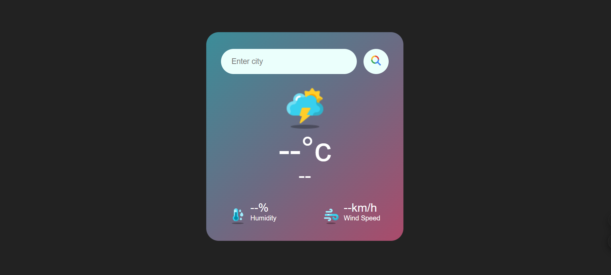

# Weather App



## Project Name: Weather App

### Personal Information:
- **Name:** Shreyas
- **ID:** CT08DS2377
- **Company:** CODTECH IT SOLUTIONS
- **Domain:** Web Development
- **Duration:** June - July 2024
- **Mentor:** Neela Santosh Kumar

## Overview

This is a simple and interactive weather application built using HTML, CSS, and JavaScript. It allows users to check the current weather conditions for any location, providing a straightforward way to stay informed about the weather.

## Objective

This application aims to be a user-friendly tool that helps users:

- Quickly access the current weather information for any location.
- View key weather details such as temperature, humidity, and weather conditions.
- Enhance user experience by providing an intuitive and responsive interface.
- Plan daily activities more effectively by staying informed about the current weather.

## Technologies Used

- **HTML:** Defines the structure of the web page, including the search input, weather display, and other elements.
- **CSS:** Styles the visual elements of the application, such as the background color, fonts, and layout.
- **JavaScript:** Provides interactivity, allowing users to search for weather information and display the results.
- **Weather API:** Fetches current weather data for the specified location.

## User Interface (UI) Elements

- **Search Input:** Users enter the location (city, country) here to get the weather information.
- **Search Button:** Clicking this button fetches and displays the weather information for the entered location.
- **Weather Display:** Shows current weather details including temperature, humidity, and weather conditions.
- **Error Message:** Displays if there’s an issue fetching the weather data or if the location is not found.

## Functionality

- **Searching Weather:** Users enter a location in the search input and click the "Search" button to get the current weather information.
- **Displaying Weather:** The app shows key weather details such as temperature, humidity, and weather conditions for the specified location.
- **Handling Errors:** If the location is invalid or there's an issue with the API, an error message is displayed.

## Installation

To install and run this project locally, follow these steps:

1. Clone the repository:
    ```bash
    git clone https://github.com/your-username/weather-app.git
    ```

2. Navigate to the project directory:
    ```bash
    cd weather-app
    ```

3. Open the `index.html` file in your browser:
    ```bash
    open index.html
    ```

## Usage

1. Enter a location in the search field and click the "Search" button.
2. View the current weather conditions displayed on the page.
3. If the location is invalid or there's an issue, an error message will be shown.

## Screenshot


## Contributing

Contributions are welcome! Please feel free to submit a Pull Request.

## License

This project is licensed under the MIT License - see the [LICENSE](LICENSE) file for details.
